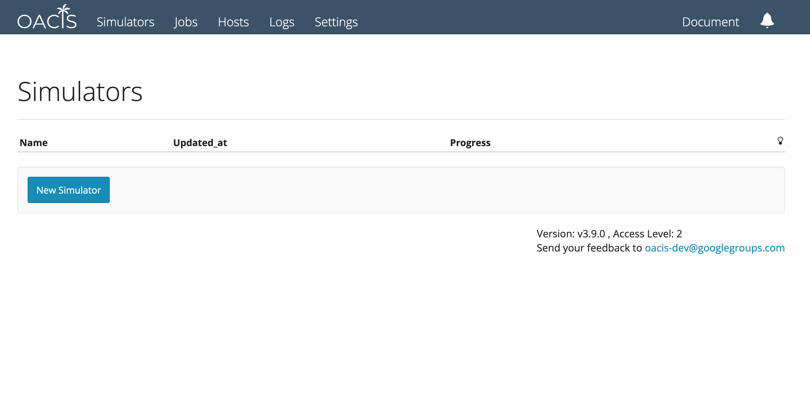
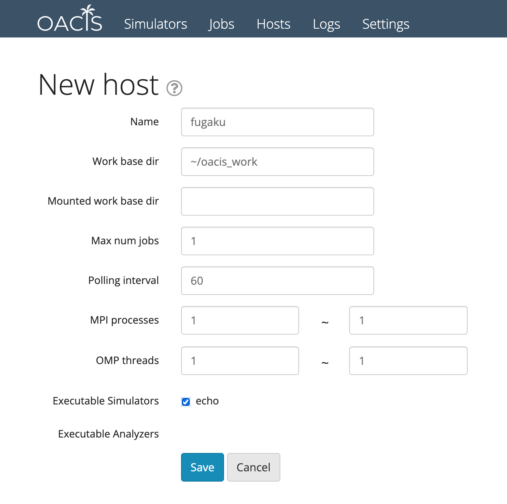

# Dockerfile for OACIS

[](https://badge.fury.io/gh/crest-cassia%2Foacis_docker)
[](https://registry.hub.docker.com/r/oacis/oacis/)
[](https://travis-ci.org/crest-cassia/oacis_docker)

Ready-to-run [OACIS](https://github.com/crest-cassia/oacis) application in Docker.

## Quick Start

### 0. (prerequisite) install docker & docker compose

- https://docs.docker.com/get-docker/
- https://docs.docker.com/compose/install/

### 1. Clone oacis_docker_tools

```shell
git clone https://github.com/crest-cassia/oacis_docker.git
cd oacis_docker
```

### 2. Start OACIS container

```shell
$ ./oacis_boot.sh
```

A container of OACIS launches. It takes some time until the launch completes.

- Visit http://localhost:3000 to access OACIS like the following. You may change the port by specifying `-p` option.
- Visit http://localhost:8888 to access Jupyter notebook with OACIS API. The port may be changed by `-j` option.



See [OACIS documentation](http://crest-cassia.github.io/oacis/).

### 3. stopping the container temporarily

```shell
$ ./oacis_stop.sh
```

Even after the server is stopped, the data (including your simulation results) are not deleted. In other words, the virtual machine image still exists.
Restart the container by running `oacis_start.sh`.

```shell
$ ./oacis_start.sh
```

## Other commands

### stopping the container permanently

When you would like to remove the docker container as well as the docker volumes, run the following command:

```shell
$ ./oacis_terminate.sh
```

Note: **The database is deleted. Make sure to make a backup if you want to save your results somewhere.**

The simulation output files are stored in `Result` directory, which is *NOT* deleted by the above command. To delete all the files, remove `Result` directory as well.

```shell
$ rm -rf Result
```

### making a backup and restoring from it

When we would like to move all the data to other directory or make a backup, run the following command:
```shell
$ ./oacis_dump_db.sh
```
All the data stored in the database running on the container are dumped into `Result/db_dump`.

After you run the above command, send `Result` directory to the place you like. For instance, run the following:
```shell
$ rsync -avhz --progress Result /path/to/backup
```

To restore the data from a backup, copy the backup to the `Result` directory first and then run the restore command.
Make sure that OACIS must be running when restoring the DB.
```shell
$ rsync -avhz --progress /path/to/backup Result
$ ./oacis_boot.sh                # OACIS must be launched in advance
$ ./oacis_restore_db.sh
```

### logging to the shell

When you would like to login to the shell on the docker container for trouble shooting, run the following command:

```shell
$ ./oacis_shell.sh
```

## Set up for the Tutorial

### Registering a sample simulator

The following command registers a sample simulator "ns_model" that is used in the [tutorial of OACIS](http://crest-cassia.github.io/oacis/en/tutorial.html).
After you add this simulator, Step1 and Step2 of this tutorial are already done. You can start from Step3.

```shell
$ ./oacis_shell.sh
# (login to the container)
$ bash ./setup_ns_model.sh
$ exit     # to logout from the container
```

The source code of this sample simulator can be found at [yohm/sim_ns_model](https://github.com/yohm/sim_ns_model).

## SSH agent setup

On the container, you can use the SSH agent running on the **host OS**. (Hereafter, the host on which docker is running is called **host OS**). If environemnt varialbe `SSH_AUTH_SOCK` is set in the host OS so that you can connect to remote hosts from OACIS.
Here is how to set up SSH agent.

### 1. Create a key pair and add it to authorized_keys.

OACIS requires an authentication by SSH keys. If you haven't made a SSH key-pair, create one in order to use it for your use.

```shell
$ ssh-keygen -t rsa
```

You may enter a passphrase when making a key-pair. The key pair will be created in `~/.ssh` directory.

### 2. Setup ssh-agent

Set up ssh-agent on your host OS.
Launch SSH agent as follows. On macOS, SSH agent is automatically launched so you can skip this step.

```shell
$ eval $(ssh-agent)
Agent pid 97280
```

The information required for SSH connection is determined by this file.


### 3. Add your key to the agent.

You'll be required to enter the passphrase for this key.

```shell
$ ssh-add ~/.ssh/id_rsa
```

Now you should be able to connect to a remote host ***wihtout entering a password***.

```shell
$ ssh my_remote_host
```

(If you are going to use the **host OS** as one of the computational hosts for OACIS) Add this key to the list of `authorized_keys`. Make sure the permission of the `authorized_keys` is 600 when you make this file for the first time. You should be able to login to the `localhost` without entering your password.

```shell
$ cat ~/.ssh/id_rsa.pub >> ~/.ssh/authorized_keys
$ chmod 600 authorized_keys
$ ssh localhost     # password should not be required
```

### 4. setup xsub in remote hosts

Set up [xsub](http://github.com/crest-cassia/xsub) or [xsub_py](https://github.com/crest-cassia/xsub_py) on remote hosts. See README of the repository for the details.

### 5. Launch OACIS

When these set up are done, launch OACIS.

```shell
$ ./oacis_boot.sh
```

### 6. Edit `.ssh/config` on the container

OACIS refers to `.ssh/config` file when making SSH connections. Run

```shell
$ ./oacis_shell.sh
```

to login to the container. On the container, edit `.ssh/config` file.

```shell
$ vi ~/.ssh/config
```

Here is an example of the config file. `docker-host` is the host running the docker.
When you want to access a server located in the intranet, use `ProxyJump` to login via docker-host.

```
Host my_intra_server
  User my_user
  HostName my_intra_server
  ProxyJump docker-host
Host my_server
  User my_user
  HostName my_server.example.com
```


### 6. Register your host OS on OACIS

Go to the page of host list. http://localhost:3000/hosts
Select `New Host` and fill in the host information. You can add hosts that are listed in `~/.ssh/config`.
See the document for details: [How to setup host on OACIS](http://crest-cassia.github.io/oacis/en/configuring_host.html)



Add a host with the reserved name "**docker-host**" to use your host OS as a computational host. You'll be able to run your simulators on your host OS.

## synchronizing data with another OACIS

When you would like to copy your data to another OACIS instance in another machine, run a shell script like the following. (Replace `your_host_name` with your actual host name).

```bash
#!/bin/bash

set -eux
./oacis_dump_db.sh
rsync -ahv --progress Result/ your_remote_host:oacis_docker/Result
ssh your_remote_host '~/oacis_docker/oacis_restore_db.sh'
```

## updating OACIS image

Take the following steps to update the docker image of OACIS.

1. `./oacis_dump_db.sh`
2. `./oacis_terminate.sh`
3. `docker pull oacis/oacis_jupyter`
4. `./oacis_boot.sh`
5. `./oacis_restore_db.sh`

# License
oacis_docker is a part of OACIS. [OACIS](https://github.com/crest-cassia/oacis) is published under the term of the MIT License (MIT).
Copyright (c) 2014-2022 RIKEN AICS, RIKEN R-CCS


# Note for Developers

## available docker images

- [oacis](oacis)
    - A base image, which consists of OACIS and its prerequisites.
- [oacis\_jupyter](oacis_jupyter)
    - On top of the "base" image, Python and Jupyter environments are installed.

## running an image built from the source code

When you would like to build an OACIS image from source rather than pulling an image from dockerhub, run `oacis_boot.sh` with `--build-image OACIS_VERSION` option.
For instance, when you would like to build an OACIS image from `develop` branch, run the following.

```shell
$ ./oacis_boot.sh --build-image develop
```

Note this command requires some time to build an image.

## creating images for a specific version of OACIS

To create images for a specific version of OACIS and push them to dockerhub, edit `OACIS_VERSION` in "version_tagging.sh" and run it as following.

```
git pull
# edit "version_tagging.sh"
git commit version_tagging.sh
docker login
./version_tagging.sh
git tag -a ${OACIS_VERSION} -m "version ${OACIS_VERSION}"
git push
git tag --push
```
