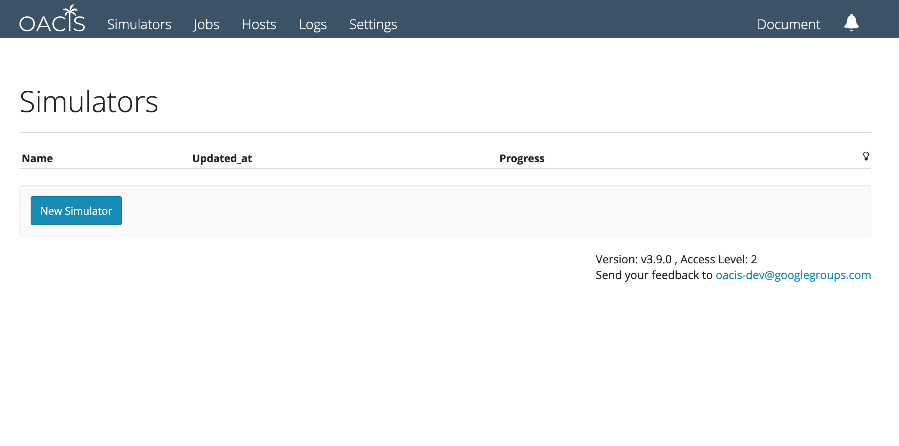
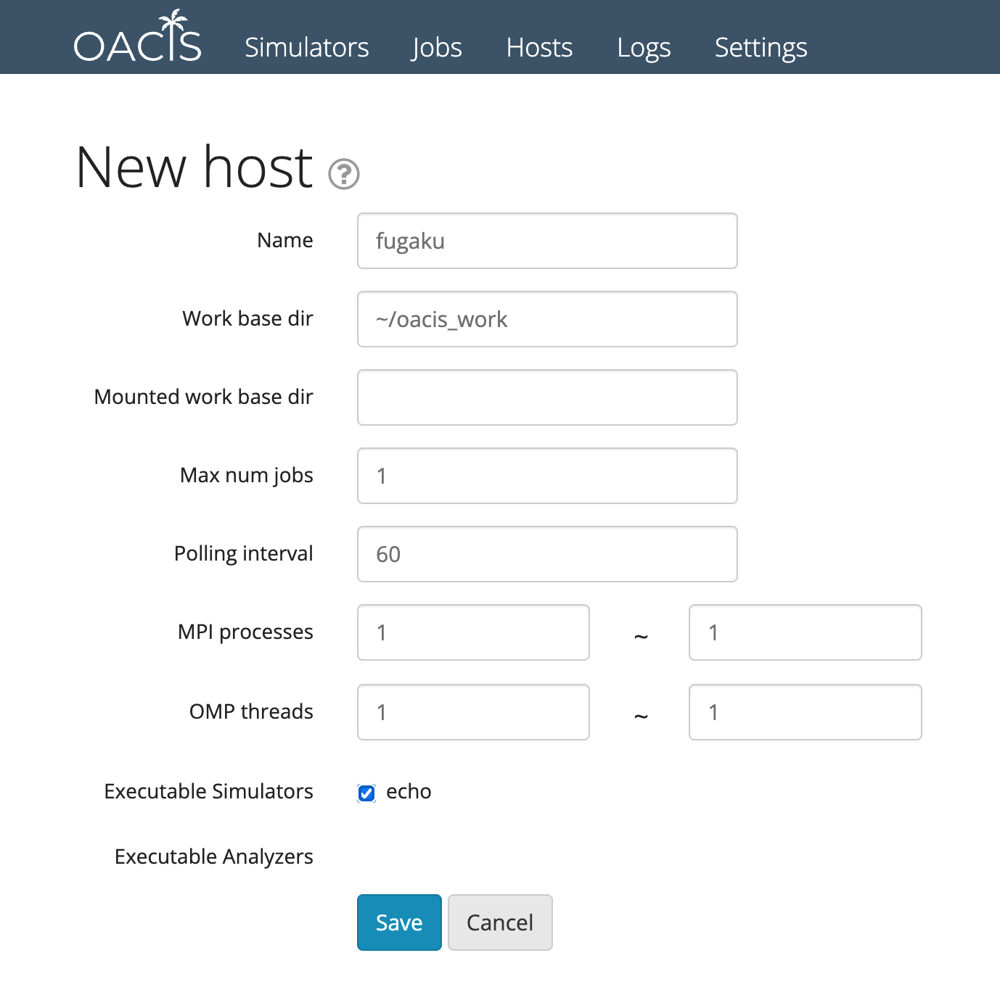

# Dockerfile for OACIS

[](https://badge.fury.io/gh/crest-cassia%2Foacis_docker)
[](https://registry.hub.docker.com/r/oacis/oacis/)

Ready-to-run [OACIS](https://github.com/crest-cassia/oacis) application in Docker.

## Quick Start

### 0. (prerequisite) install docker & docker compose

- https://docs.docker.com/get-docker/
- https://docs.docker.com/compose/install/

### 1. Clone oacis_docker

```shell
git clone https://github.com/crest-cassia/oacis_docker.git
cd oacis_docker
```

### 2. Start OACIS container

> [!NOTE]
> ### Booting Container on Ubuntu
> 
> Due to differences between macOS and Ubuntu, configuring the installation to allow the localhost (Docker container) to connect to the docker-host (Ubuntu machine) requires additional steps. If the jobs require the installation of libraries that are not provided in the OACIS Docker container, then running the jobs on the docker-host will allow the scripts to access the software available on the docker-host. Unlike [on macOS](README.md#ssh-agent-setup), setting up the ssh keys must be done before booting OACIS. In order to install OACIS in Ubuntu with the ability to run jobs on the docker-host:
> 
> - Install dependencies on Ubuntu machine, which are also required for other systems
>    - [Docker](https://docs.docker.com/engine/install/ubuntu/#installation-methods)
>    - Ruby
>        - Using apt: `sudo apt install ruby`
>        - This Ruby is only used by `xsub` on the docker-host; the version installed by apt is sufficient. (OACIS itself requires Ruby 3.2 or later, but it is bundled inside the container, so you do not need it on the host.)
>    - [xsub](https://github.com/crest-cassia/xsub)
>        - clone directory and add paths to `~/.bash_profile`
>- Install dependencies on Ubuntu machine, specific to Ubuntu:
>    - `openssh-server` to allow remote connection to docker-host from Docker container
>        - Using apt: `sudo apt install openssh-server`
>        - If the ssh server is not installed, then the OACIS Docker container will not be able to connect to the docker-host.
>- Configure ssh keys
>    - Add public key from Ubuntu machine to its own authorized keys
>        - `cat ~/.ssh/id_ed25519.pub >> ~/.ssh/authorized_keys`
>    - Add key to the SSH agent
>        - `ssh-add ~/.ssh/id_ed25519`
>    - If the ssh key is not set up correctly, then the password authentication will prevent the Docker container from connecting to the docker-host.
>- Run `sudo -E ./oacis_boot.sh`
>    - Unlike on macOS, running Docker on Ubuntu requires `sudo`. The `-E` option preserves the environment within sudo, as the OACIS Docker environment setup specifically requires `SSH_AUTH_SOCK` in order for the Docker container to have access to the SSH agent.
>- To confirm the installation is correct:
>    - Confirm that "Check Scheduler Status" under "Hosts" -> "docker-host" in the browser shows a schedule status, rather than an error
>    - Submit a job to from OACIS to the docker-host, and confirm that it progresses to "finished" rather than "failed"

```shell
$ ./oacis_boot.sh
```

A container of OACIS launches. It takes some time until the launch completes.
The Compose stack uses the stable MongoDB 8.0 series (currently `mongo:8.0.10`)
and waits for MongoDB and Redis to become healthy before starting OACIS.
`oacis_boot.sh` returns after the OACIS container's HTTP healthcheck succeeds.

- Visit http://localhost:3000 to access OACIS like the following. You may change the port by specifying `-p` option.



See [OACIS documentation](http://crest-cassia.github.io/oacis/).

### Checking container health

Run the following command to inspect all three services:

```shell
$ docker compose ps
```

The `mongo`, `redis`, and `oacis` services should all show `healthy`. MongoDB is
checked with an administrative ping after first-run initialization is complete,
Redis must answer `PONG`, and OACIS must return a successful response from
`http://localhost:3000/` inside its container.

Both `oacis_boot.sh` and `oacis_start.sh` stop waiting and return a non-zero
status if a service becomes unhealthy or OACIS does not become healthy within
10 minutes. Override the limit in seconds with `OACIS_HEALTH_TIMEOUT`, for
example:

```shell
$ OACIS_HEALTH_TIMEOUT=900 ./oacis_boot.sh
```

On failure, the scripts print `docker compose ps` and recent logs for OACIS,
MongoDB, and Redis. To inspect them again, run:

```shell
$ docker compose logs oacis
$ docker compose logs mongo
$ docker compose logs redis
```

These Compose changes do not pin the OACIS image tag, the OACIS Git source
reference used for local builds, the Ruby base image, or the xsub version.

### 3. stopping the container temporarily

```shell
$ ./oacis_stop.sh
```

Even after the server is stopped, the data (including your simulation results) are not deleted. In other words, the virtual machine image still exists.
Restart the container by running `oacis_start.sh`.

```shell
$ ./oacis_start.sh
```

## Other commands

### stopping the container permanently

When you would like to remove the docker container as well as the docker volumes, run the following command:

```shell
$ ./oacis_terminate.sh
```

Note: **The database is deleted. Make sure to make a backup if you want to save your results somewhere.**

The simulation output files are stored in `Result` directory, which is *NOT* deleted by the above command. To delete all the files, remove `Result` directory as well.

```shell
$ rm -rf Result
```

### making a backup and restoring from it

When we would like to move all the data to other directory or make a backup, run the following command:
```shell
$ ./oacis_dump_db.sh
```
All the data stored in the database running on the container are dumped into `Result/db_dump`.

After you run the above command, send `Result` directory to the place you like. For instance, run the following:
```shell
$ rsync -avhz --progress Result /path/to/backup
```

To restore the data from a backup, copy the backup to the `Result` directory first and then run the restore command.
Make sure that OACIS must be running when restoring the DB.
```shell
$ rsync -avhz --progress /path/to/backup Result
$ ./oacis_boot.sh                # OACIS must be launched in advance
$ ./oacis_restore_db.sh
```

### logging to the shell

When you would like to login to the shell on the docker container for trouble shooting, run the following command:

```shell
$ ./oacis_shell.sh
```

## Set up for the Tutorial

### Registering a sample simulator

The following command registers a sample simulator "ns_model" that is used in the [tutorial of OACIS](http://crest-cassia.github.io/oacis/en/tutorial.html).
After you add this simulator, Step1 and Step2 of this tutorial are already done. You can start from Step3.

```shell
$ ./oacis_shell.sh
# (login to the container)
$ bash ./setup_ns_model.sh
$ exit     # to logout from the container
```

The source code of this sample simulator can be found at [yohm/sim_ns_model](https://github.com/yohm/sim_ns_model).

## MCP server for AI agents (OACIS v4)

OACIS v4 ships an [MCP (Model Context Protocol)](https://modelcontextprotocol.io) server, which lets AI agents such as Claude and Codex create parameter sets, submit and monitor runs, read result files, and trigger analyzers.
Use the `oacis_mcp.sh` wrapper script to launch it inside the running container. Register it with your AI agent as follows.

### Claude Code

```shell
claude mcp add oacis -- /path/to/oacis_docker/oacis_mcp.sh
```

### Codex

```shell
codex mcp add oacis -- /path/to/oacis_docker/oacis_mcp.sh
```

Confirm that Codex has registered the server with `codex mcp list`. Start a new Codex session before using the OACIS tools.

The server speaks JSON-RPC over stdio; it opens no network port. OACIS must be running (`./oacis_boot.sh`) when the agent connects.
See the [OACIS MCP documentation](http://crest-cassia.github.io/oacis/en/mcp.html) for the available tools and the security model.

## Running multiple OACIS instances on one machine

You can run several independent OACIS instances on a single machine by cloning `oacis_docker` into a separate directory for each instance. Each checkout gets its own docker compose project — its own containers, database, and `Result` directory.

`oacis_boot.sh` chooses a collision-free compose project name automatically, so the checkouts do not have to have unique directory names: if the default name (derived from the directory basename) is already used by another checkout, a unique suffix derived from the directory path is appended. The chosen name is printed at boot and pinned in the generated `.env` file, so all the other scripts (`oacis_stop.sh`, `oacis_mcp.sh`, ...) address the same instance, and later boots keep using the same name. To pick a name yourself, boot with `./oacis_boot.sh --name my_project`. If you copy a whole checkout (including its `.env`) to another directory to start a new instance, delete the copied `.env` first so that a fresh project name is chosen — `oacis_boot.sh` refuses to boot on a pinned name that another checkout's stack is using.

Two things must be distinguished per instance by hand:

- The web UI port: give each instance its own port with `./oacis_boot.sh -p <port>`.
- The MCP server name: register each instance's `oacis_mcp.sh` under a distinct name, e.g.

```shell
claude mcp add oacis_proj_a -- /path/to/proj_a/oacis_docker/oacis_mcp.sh
claude mcp add oacis_proj_b -- /path/to/proj_b/oacis_docker/oacis_mcp.sh
```

MCP itself opens no network port, so instances never conflict there; the registered name is what tells the agent which instance it is talking to.

## SSH agent setup

On the container, you can use the SSH agent running on the **host OS**. (Hereafter, the host on which docker is running is called **host OS**). If environemnt varialbe `SSH_AUTH_SOCK` is set in the host OS so that you can connect to remote hosts from OACIS.
Here is how to set up SSH agent.

### 1. Create a key pair and add it to authorized_keys.

OACIS requires an authentication by SSH keys. If you haven't made a SSH key-pair, create one in order to use it for your use.

```shell
$ ssh-keygen -t rsa
```

You may enter a passphrase when making a key-pair. The key pair will be created in `~/.ssh` directory.

### 2. Setup ssh-agent

Set up ssh-agent on your host OS.
Launch SSH agent as follows. On macOS, SSH agent is automatically launched so you can skip this step.

```shell
$ eval $(ssh-agent)
Agent pid 97280
```

The information required for SSH connection is determined by this file.


### 3. Add your key to the agent.

You'll be required to enter the passphrase for this key.

```shell
$ ssh-add ~/.ssh/id_rsa
```

Now you should be able to connect to a remote host ***wihtout entering a password***.

```shell
$ ssh my_remote_host
```

(If you are going to use the **host OS** as one of the computational hosts for OACIS) Add this key to the list of `authorized_keys`. Make sure the permission of the `authorized_keys` is 600 when you make this file for the first time. You should be able to login to the `localhost` without entering your password.

```shell
$ cat ~/.ssh/id_rsa.pub >> ~/.ssh/authorized_keys
$ chmod 600 authorized_keys
$ ssh localhost     # password should not be required
```

### 4. setup xsub in remote hosts

Set up [xsub](http://github.com/crest-cassia/xsub) or [xsub_py](https://github.com/crest-cassia/xsub_py) on remote hosts. See README of the repository for the details.

### 5. Launch OACIS

When these set up are done, launch OACIS.

```shell
$ ./oacis_boot.sh
```

### 6. Edit `.ssh/config` on the container

OACIS refers to `.ssh/config` file when making SSH connections. Run

```shell
$ ./oacis_shell.sh
```

to login to the container. On the container, edit `.ssh/config` file.

```shell
$ vi ~/.ssh/config
```

Here is an example of the config file. `docker-host` is the host running the docker.
When you want to access a server located in the intranet, use `ProxyJump` to login via docker-host.

```
Host my_intra_server
  User my_user
  HostName my_intra_server
  ProxyJump docker-host
Host my_server
  User my_user
  HostName my_server.example.com
```


### 6. Register your host OS on OACIS

Go to the page of host list. http://localhost:3000/hosts
Select `New Host` and fill in the host information. You can add hosts that are listed in `~/.ssh/config`.
See the document for details: [How to setup host on OACIS](http://crest-cassia.github.io/oacis/en/configuring_host.html)



Add a host with the reserved name "**docker-host**" to use your host OS as a computational host. You'll be able to run your simulators on your host OS.

## synchronizing data with another OACIS

When you would like to copy your data to another OACIS instance in another machine, run a shell script like the following. (Replace `your_host_name` with your actual host name).

```bash
#!/bin/bash

set -eux
./oacis_dump_db.sh
rsync -ahv --progress Result/ your_remote_host:oacis_docker/Result
ssh your_remote_host '~/oacis_docker/oacis_restore_db.sh'
```

## updating OACIS image

> [!IMPORTANT]
> If you are upgrading from OACIS v3 to v4, read [MIGRATION_V3_TO_V4.md](MIGRATION_V3_TO_V4.md) first.

Take the following steps to update the docker image of OACIS.

1. `./oacis_dump_db.sh`
2. `./oacis_terminate.sh`
3. `docker pull oacis/oacis`
4. `./oacis_boot.sh`
5. `./oacis_restore_db.sh`

# License
oacis_docker is a part of OACIS. [OACIS](https://github.com/crest-cassia/oacis) is published under the term of the MIT License (MIT).
Copyright (c) 2014-2026 RIKEN R-CCS


# Note for Developers

## available docker images

- [oacis](oacis)
    - A base image, which consists of OACIS and its prerequisites.

Note: the current Dockerfile is based on Ruby 3.4 and can only build OACIS v4 (the `develop` branch or `v4.x` tags). To build a v3 image, check out an older tag of oacis_docker (e.g. `v3.12.0`).

## running an image built from the source code

When you would like to build an OACIS image from source rather than pulling an image from dockerhub, run `oacis_boot.sh` with `--build-image OACIS_VERSION` option.
For instance, when you would like to build an OACIS image from `develop` branch, run the following.

```shell
$ ./oacis_boot.sh --build-image develop
```

Note this command requires some time to build an image.

## creating images for a specific version of OACIS

To create images for a specific version of OACIS and push them to dockerhub, edit `OACIS_VERSION` in "version_tagging.sh" and run it as following.

```
git pull
# edit "version_tagging.sh"
git commit version_tagging.sh
docker login
./version_tagging.sh
git tag -a ${OACIS_VERSION} -m "version ${OACIS_VERSION}"
git push
git tag --push
```

Note: As of August 2025, the build process must be performed both on 'linux/amd64' and 'linux/arm64' architectures. Building a 'linux/amd64' image on a Mac with Apple Silicon is not recommended due to the significant time required for building dependent gems on virtualization.
